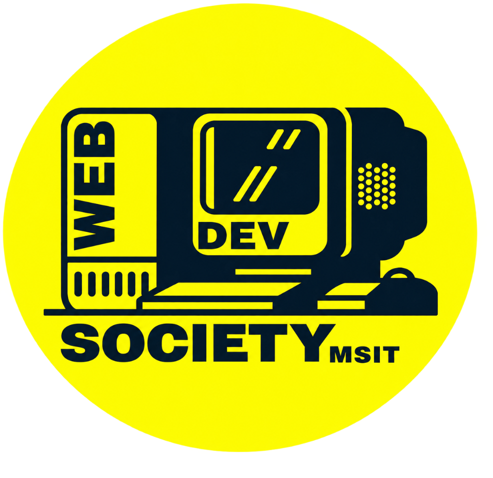

<div align="center">

```
 __          __ _____    _____   __  __ _____ _____ _______ 
 \ \        / /|  __ \  / ____| |  \/  |/ ____|_   _|__   __|
  \ \  /\  / / | |  | || (___   | \  / | (___   | |    | |   
   \ \/  \/ /  | |  | | \___ \  | |\/| |\___ \  | |    | |   
    \  /\  /   | |__| | ____) | | |  | |____) |_| |_   | |   
     \/  \/    |_____/ |_____/  |_|  |_|_____/|_____|  |_|   
                                                             
  ===========================================================
  WEB DEVELOPMENT SOCIETY — MAHARAJA SURAJMAL INSTITUTE OF TECH
  ===========================================================
```



### **`>_ YOUR CODE. YOUR IDEAS. YOUR COMMUNITY.`**
**`BUILT BY STUDENTS. FOR STUDENTS.`**

[](https://nextjs.org/)
[](https://www.typescriptlang.org/)
[](https://tailwindcss.com/)
[](https://developers.notion.com/)
[](https://developer.mozilla.org/en-US/docs/Web/API/Web_Audio_API)
[](LICENSE)

[**Explore Live Website**](https://wds-msit.org) • [**Live Bug Hunt**](https://wds-bug-hunt.netlify.app/bug-hunt) • [**Recruitment Portal**](https://wds-msit.org/recruitment) • [**Interactive Terminal**](https://wds-msit.org/terminal) • [**Admin Hub**](https://wds-msit.org/hub)

---

</div>

## 📌 Table of Contents

- [Overview & Vision](#-overview--vision)
- [Design Identity & Aesthetic](#-design-identity--aesthetic)
- [Ecosystem & Core Features](#-ecosystem--core-features)
- [Project Architecture & Directory Structure](#-project-architecture--directory-structure)
- [Tech Stack](#-tech-stack)
- [Getting Started](#-getting-started)
- [Notion Database Integration](#-notion-database-integration)
- [Interactive Terminal Shell](#-interactive-terminal-shell)
- [WDS Website Hub Dashboard](#-wds-website-hub-dashboard)
- [Contributing & Git Workflow](#-contributing--git-workflow)
- [Society Information & Contact](#-society-information--contact)

---

## ⚡ Overview & Vision

**Web Development Society (WDS) — MSIT** is the premier student-led technology organization and engineering collective at **Maharaja Surajmal Institute of Technology, New Delhi**.

Unlike generic college clubs, WDS operates as a modern digital ecosystem: building, maintaining, and deploying real-world software platforms, empowering student developers through hands-on technical ownership, open-source culture, and collaborative problem-solving.

```
       ┌─────────────────────────────────────────────────────────────┐
       │                   WDS DIGITAL ECOSYSTEM                     │
       └──────────────────────────────┬──────────────────────────────┘
                                      │
         ┌────────────────────┬───────┴────────┬────────────────────┐
         │                    │                │                    │
  ┌──────▼──────┐      ┌──────▼──────┐  ┌──────▼──────┐      ┌──────▼──────┐
  │ MSIT PORTAL │      │  BUG HUNT   │  │ NEWSLETTER  │      │ FRESHERS    │
  │  (Official) │      │  (Bug QA)   │  │   ENGINE    │      │     HUB     │
  └─────────────┘      └─────────────┘  └─────────────┘      └─────────────┘
```

---

## 🎨 Design Identity & Aesthetic

The visual language follows an authentic synthesis of:

$$\textbf{Retro Computing} \times \textbf{Terminal UI} \times \textbf{Pixel Art} \times \textbf{Modern Web Architecture}$$

### 🎨 Color System Tokens

| Token | Hex Code | Visual Preview | Role / Usage |
| :--- | :--- | :--- | :--- |
| **Electric Yellow** | `#FFD600` |  | Primary brand accent, active tabs, buttons, cursor, prompt (`>_`) |
| **Secondary Yellow** | `#F5C400` |  | Gradients, border highlights, elevation states |
| **Near Black (BG)** | `#050708` |  | Master background, high contrast dark canvas |
| **Dark Navy Surface** | `#07151D` |  | Secondary headers, top command bar, elevated panels |
| **Card Surface** | `#081014` |  | Interactive card containers, windows, terminal body |
| **Terminal Green** | `#00FF66` |  | `ONLINE`, `LIVE`, `SUCCESS`, and code highlights |
| **Warm Off-White** | `#F5F0DF` |  | Primary readable body text, headings |
| **Muted Slate Gray** | `#9A9D9A` |  | Secondary labels, timestamps, commit branches |

### 🕹️ Authentic Micro-Details

- **Pixel Notched Frames**: Authentic 4-corner pixel notch markers and yellow borders (`border-2 border-wds-yellow`).
- **Scanline CRT Overlay**: Subtle, performance-optimized, hydration-safe CRT raster lines.
- **Synthesized Audio Engine**: Zero-dependency retro 8-bit sound effects using the **Web Audio API** (`square`, `sawtooth`, and `triangle` oscillators) with persistent sound mute toggle in the navbar.
- **Custom Pixel Art SVG Assets**: WDS CRT monitor, 8-bit GitHub Octocat, Space Rockets, Bug Magnifier, Circuit Hubs, and Git branch commit visualization graphs.

---

## 🚀 Ecosystem & Core Features

### 1. 🖥️ Split-Screen Homepage (`/`)
- **Interactive Retro Desktop Window**: Live preview simulation of the MSIT Portal with metrics (`99.98% Uptime`, `50,000+ Active Users`).
- **What WDS Actually Does**: 3 core pillars:
  - `01 BUILD` — Develop, Design, Create
  - `02 MAINTAIN` — Debug, Update, Optimize
  - `03 SHIP` — Deploy, Test, Deliver
- **The WDS Ecosystem**: 5 interconnected platform cards linked with circuit board header lines.
- **WDS Bug Hunt Arena**: Bug bounty lifecycle (`Explore → Find → Report → Earn`), live hunter stats, points leaderboard, and reward tiers.
- **Opportunities EXP HUD**: `PLAYER 01` health & experience gauge (`EXP +100`).

### 2. 📋 Recruitment 2026 Poster & 5-Step Application (`/recruitment` & `/recruitment/apply`)
- **Full Poster Layout**: "Who can apply?", "What we look for", Timeline, 6 benefits cards, and 5-step selection process.
- **Interactive Multi-Step Application**:
  1. `Step 01`: Personal Info & Branch/Shift Picker
  2. `Step 02`: Technical & Creative Interests (Frontend, Backend, UI/UX, AI, DevOps, Content)
  3. `Step 03`: Experience Level & Profiles (GitHub, LinkedIn, Portfolio)
  4. `Step 04`: Mindset & Real-World Debugging Scenario
  5. `Step 05`: Time Commitment, Wing Preference & Review
- **Direct Notion Database Sync**: Dispatches securely to Notion via server-side API (`/api/recruitment/apply`) with mock fallback when API keys are absent.
- **Celebration Feedback**: Confetti explosion on submission, 8-bit level-up fanfare, and custom Application Reference ID receipt.

### 3. 💻 Dedicated UNIX Web Terminal (`/terminal`)
- Real interactive command shell (`WDS@MSIT:~$`) supporting:
  - `help` — Show available commands
  - `whoami` — Display developer role and student authorization
  - `ls projects/` — List active software repositories
  - `status` — Real-time server and platform health
  - `events` — View upcoming hackathons and orientations
  - `team` — Display wing leads and domain structure
  - `bughunt` — Launch bug bounty instructions
  - `join` — Open recruitment application
  - `clear` — Clear terminal buffer
  - `sudo` — Easter egg command
- Features arrow key command history traversal (Up/Down) and quick-action suggestion pills.

### 4. 📊 WDS Website Hub & Admin Dashboard (`/hub`)
- Internal productivity suite designed for professional UI/UX across all aspect ratios:
  - **7 Prioritized KPI Cards**: Total Tasks, Pending, Completed, Open Bugs, Assets, Faculty, Active Sites.
  - **Overall Sprint Progress**: Circular gauge (67% target) with linear segmented breakdown.
  - **Upcoming Tasks Checklist**: Interactive check-to-complete with real-time status toggling.
  - **Recent Activity Stream**: Chronological system audit log.
  - **Quick Links Matrix**: 1-click navigation directory.
  - **Subsystems**: Task Management Board, Bug Tracker, Asset Drive, Websites Directory.
  - **Global Command Palette (`⌘K` / `Ctrl+K`)**: Instant search modal for views, tasks, and system commands.

### 5. 🐙 Master Git Commit HUD Footer (`components/Footer.tsx`)
- Git branch visualization (`YOU ARE HERE` / `Improve. Build. Repeat.`).
- 8-bit GitHub Octocat with direct contributor CTA.
- Live server status box (`SERVERS: ACTIVE`, `PROJECTS: LIVE`, `COMMUNITY: GROWING`).
- Physical campus office directory (*Room No. 201 near CSE Dept., MSIT*).

---

## 📁 Project Architecture & Directory Structure

```
WDS Main website/
├── app/
│   ├── layout.tsx              # Root Layout (MetadataBase, CRT Overlay, Navbar, Footer)
│   ├── globals.css             # Global Tailwind, Fonts, Pixel Utilities & Scanlines
│   ├── page.tsx                # Homepage (Hero, Build-Maintain-Ship, Ecosystem, Bug Hunt)
│   ├── recruitment/
│   │   ├── page.tsx            # Recruitment 2026 Landing & Poster Guide
│   │   └── apply/
│   │       └── page.tsx        # 5-Step Interactive Application Form with Confetti
│   ├── api/
│   │   └── recruitment/
│   │       └── apply/
│   │           └── route.ts    # Secure Server-Side Notion Database Dispatcher
│   ├── opportunities/
│   │   └── page.tsx            # Player 01 EXP HUD & Career Opportunities Matrix
│   ├── terminal/
│   │   └── page.tsx            # Full-Screen Interactive Web Shell
│   ├── hub/
│   │   └── page.tsx            # WDS Website Hub & Productivity Dashboard (Responsive)
│   ├── projects/
│   │   └── page.tsx            # Filterable Project Showcase
│   ├── about/
│   │   └── page.tsx            # History, Ethos, Student Ownership & Open-Source Culture
│   ├── team/
│   │   └── page.tsx            # Technical, Design, Content & Operations Wings
│   ├── contact/
│   │   └── page.tsx            # Campus HQ, Email, Socials & Collaboration Dispatch
│   ├── robots.ts               # Search Engine Crawler Directives
│   └── sitemap.ts              # Dynamic Sitemap Generation
├── components/
│   ├── Navbar.tsx              # Desktop Fixed Navbar + Fullscreen Mobile Terminal Drawer
│   ├── Footer.tsx              # Master Footer with Git Branch Graph & Octocat Pixel Art
│   ├── InteractiveTerminal.tsx # UNIX CLI Engine with History & Sound Feedback
│   └── ui/
│       ├── PixelIcons.tsx      # SVG Pixel Art Library (WDS Logo, Octocat, Rockets, Bugs)
│       ├── PixelButton.tsx     # Audio-Reactive Pixel Corner Buttons
│       ├── PixelCard.tsx       # 4-Corner Notched Frame Container
│       ├── TerminalWindow.tsx  # Retro PC Window Wrapper with Titlebar Controls
│       ├── StatusBadge.tsx     # Glowing Status Pills (ONLINE, LIVE, ACTIVE)
│       ├── SectionHeader.tsx   # Pixel Prompt (>_) Section Dividers
│       ├── MarqueeTicker.tsx   # Infinite Retro Scrolling Marquee
│       └── CRTOverlay.tsx      # Hydration-Safe Subtle Scanline Rasterizer
├── lib/
│   ├── soundEffects.ts         # Native Web Audio API Synthesizer (Click, Success, Keypress)
│   ├── notion.ts               # Notion Client SDK & Recruitment Schema Mapper
│   ├── projectsData.ts         # Central Data Definitions for All WDS Platforms
│   └── teamData.ts             # Wing Structure, Roles & Technology Stacks
├── public/
│   ├── favicon.ico             # Official WDS Logo Favicon
│   └── images/
│       └── wds-logo.png        # High-Resolution Official WDS Logo
├── tailwind.config.ts          # Custom WDS Color Palette, Pixel Box Shadows & Keyframes
├── tsconfig.json               # TypeScript Configuration with `@/*` Aliases
├── package.json                # Project Dependencies & Build Scripts
└── README.md                   # Repository Documentation
```

---

## 🛠️ Tech Stack

- **Core Framework**: [Next.js 14](https://nextjs.org/) (App Router, Server Components & Route Handlers)
- **Language**: [TypeScript 5](https://www.typescriptlang.org/) (Strict Mode)
- **Styling**: [Tailwind CSS 3.4](https://tailwindcss.com/) + Custom Retro Design Utilities
- **Typography**: `Press Start 2P`, `Silkscreen`, `Space Mono`, `Inter` (Google Fonts)
- **Database / Backend**: [Notion API](https://developers.notion.com/) (`@notionhq/client`)
- **Sound Engine**: Native [Web Audio API](https://developer.mozilla.org/en-US/docs/Web/API/Web_Audio_API) (Zero external audio assets)
- **Animation & FX**: Custom CSS Scanlines + [Canvas Confetti](https://www.npmjs.com/package/canvas-confetti)
- **Icons**: [Lucide React](https://lucide.dev/) + Handcrafted SVG Pixel Art Library

---

## 💻 Getting Started

### Prerequisites

- **Node.js**: `v18.17.0` or higher
- **npm** / **yarn** / **pnpm**

### Installation

1. **Clone the repository**:
   ```bash
   git clone https://github.com/JayantOlhyan/WDS-website.git
   cd WDS-website
   ```

2. **Install dependencies**:
   ```bash
   npm install
   ```

3. **Configure Environment Variables**:
   Copy the `.env.example` template:
   ```bash
   cp .env.example .env.local
   ```

4. **Launch the development server**:
   ```bash
   npm run dev
   ```
   Open [http://localhost:3000](http://localhost:3000) in your browser.

5. **Build for Production**:
   ```bash
   npm run build
   npm start
   ```

---

## 🗄️ Notion Database Integration

The recruitment application at `/recruitment/apply` syncs applicant submissions into your team's **Notion Recruitment Database**.

### Setup Instructions:

1. Go to [Notion Integrations](https://www.notion.so/my-integrations) and create an **Internal Integration**.
2. Copy the **Internal Integration Secret**.
3. Create a Notion Database with the following property columns:
   - `Full Name` *(Title)*
   - `Enrollment No` *(Rich Text)*
   - `Branch` *(Select)*
   - `Section` *(Rich Text)*
   - `College Email` *(Email)*
   - `Phone` *(Phone)*
   - `Interests` *(Multi-select)*
   - `Experience Level` *(Select)*
   - `GitHub` *(URL)*
   - `LinkedIn` *(URL)*
   - `Portfolio` *(URL)*
   - `Why WDS` *(Rich Text)*
   - `Learning Goal` *(Rich Text)*
   - `Scenario Response` *(Rich Text)*
   - `Time Commitment` *(Select)*
   - `Preferred Team` *(Select)*
   - `Submitted At` *(Date)*
4. Share your database with the integration connection.
5. Add your credentials to `.env.local`:
   ```env
   NOTION_API_KEY=secret_your_notion_integration_token_here
   NOTION_DATABASE_ID=your_notion_database_id_here
   ```

> [!NOTE]
> If `NOTION_API_KEY` is not provided, the API automatically enters **Graceful Mock Mode**: logging submissions to the server terminal and returning a mock application reference ID (`mock-xxxxx`) so applicant flow is never interrupted during local testing.

---

## 🤝 Contributing & Git Workflow

We follow the WDS Git workflow established in Reference Poster #6:

```
(main) ───●──────────●──────────●──────────● (YOU ARE HERE)
           \        /            \        /
            ●──────● (feature)    ●──────● (hotfix)
            
            "Improve. Build. Repeat."
```

1. **Fork the Repository**
2. **Create a Feature Branch**:
   ```bash
   git checkout -b feat/your-feature-name
   ```
3. **Commit your changes**:
   ```bash
   git commit -m "feat(module): add amazing capability"
   ```
4. **Push to the Branch**:
   ```bash
   git push origin feat/your-feature-name
   ```
5. **Open a Pull Request** with clear description and screenshots.

---

## 📍 Society Information & Contact

- **Organization**: Web Development Society (WDS) — MSIT
- **Campus HQ**: Room No. 201 near CSE Dept., Maharaja Surajmal Institute of Technology, C-4 Janakpuri, New Delhi, Delhi 110058
- **Official Email**: [hello@wds.msit](mailto:hello@wds.msit)
- **GitHub**: [github.com/JayantOlhyan/WDS-website](https://github.com/JayantOlhyan/WDS-website)
- **Motto**: `CODE • COLLABORATE • CREATE IMPACT`

<div align="center">

```
  ♥ TOGETHER, LET'S BUILD BETTER!
  [ © 2026 WEB DEVELOPMENT SOCIETY MSIT. ALL RIGHTS RESERVED. ]
```

</div>
